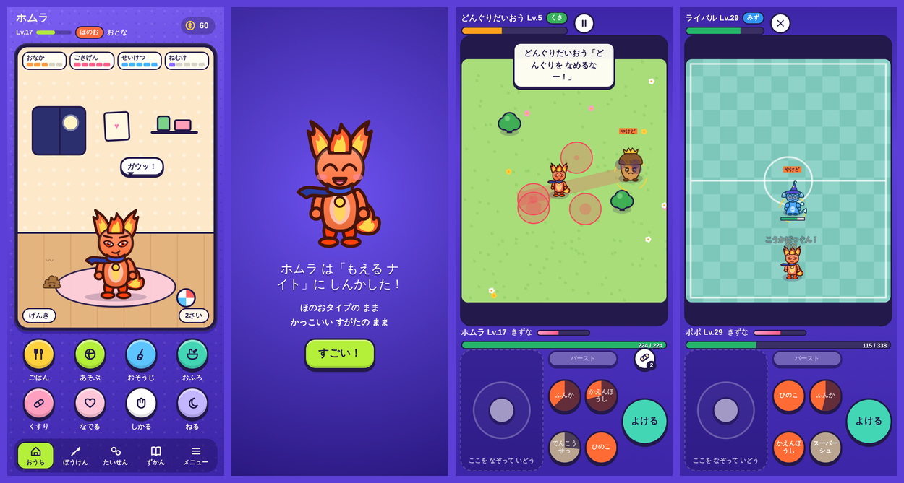

# ハグクミ

たまごから育てて、育て方で姿・タイプ・強さが変わる、いきもの育成＆リアルタイムバトルゲームです。
ブラウザだけで動くので、GitHub Pages に置けばスマホでもパソコンでも遊べます。



## どんなゲーム？

- **たまごから生まれる** — 7種類のたまご（2種類はかくし）から1つ選び、タップで温めると生まれます。名前はそのときに自分でつけます。
- **育て方で変わる**
  - 見た目（スタイル）：ままごと系で遊ぶと「かわいい」、スポーツ系だと「かっこいい」、あたま系だと「かしこい」、バトルばかりだと「たくましい」姿になります。
  - タイプ：食べ物で決まります（おにく→ほのお、おさかな・おふろ→みず、サラダ→くさ、パチパチキャンディ→でんき、こんぺいとう・なでる・完璧なお世話→ひかり）。**お世話ミスが多いと「やみ」タイプ**になります。一度やみになると、その後の進化でも元のタイプには戻りません。
  - 能力：遊んだミニゲームや食べ物で、たいりょく・こうげき・ぼうぎょ・すばやさ・かしこさが伸びます。
  - ベビー → こども → おとな → きわみ の4段階。姿は 7タイプ × 4スタイル × 3段階 ＋ ベビー7種 ＝ 91種類（ずかんで集められます）。
- **お世話しないと死んでしまう** — おなか・ごきげん・せいけつ・ねむけ・びょうき・うんちがあり、アプリを閉じていても時間が進みます。
  - おなか・ごきげんが0、病気、うんち4個以上を15分ほうっておくと「お世話ミス」。夜9時から寝かせられ、23時を過ぎてだれもいないと一人で寝ます。朝6時まで眠り、眠っている間はお世話ミスになりません。
  - 朝と夜の1日2回お世話（ごはん・そうじ・1回くらい遊ぶ）すれば安心。**まる1日（24時間）ほど放っておくと死んでしまいます**。1回お世話を忘れただけでも危なく、1日1回のお世話では続きません。
  - 出かけるときは「あずかりや」に預けると時間が止まります（6時間〜3日）。ステータスの「お世話ミスの記録」で、いつ・何のミスだったか確認できます。
- **一体だけでストーリーを進める** — 町の「くろいもや」をはらう全8章＋チュートリアル。**ストーリーのバトルで負けると、その子は死んでしまいます**（途中でアプリが閉じても、次に開いたときに閉じたときのHPのまま続きから。逃げることはできません）。死んだ子は「おもいで」に残り、次の子は少しだけ強く生まれます。
- **ポケモン Z-A 風のリアルタイムバトル** — 移動しながらロックオン中の相手に技を出します。技ごとに「溜め」と「クールタイム」があり、とびどうぐ・範囲攻撃・ビーム・突進・設置ワナなど約60種。赤い予告範囲や弾は「よける」で回避（回避中は無敵）。攻撃したり受けたりすると「きずなゲージ」がたまり、満タンで「きずなバースト」（一定時間パワーアップ＆技が強化）。
- **スマホ同士の対人戦** — 部屋番号かQRコードでつないでリアルタイム対戦。**対人戦で負けても死にません**。「みんな Lv.50」ルールも選べます。
- ミニゲーム8種、とっくん（練習バトル）、ショップ、きせかえ、図鑑、クリア後の「ゆめのとう」。

## GitHub Pages で公開する（スマホだけでもできます）

ファイルは全部ひとつの場所（フォルダ分けなし）に置く作りなので、スマホからでもそのまま上げられます。

1. GitHub にログインし、「+」→「New repository」。名前を `hagukumi` などにして **Public** で「Create repository」。
2. できたリポジトリのページで「uploading an existing file」（または「Add file」→「Upload files」）を押す。
3. zip を展開して出てきた**ファイルを全部**選んでアップロードし、「Commit changes」（一度に100ファイルまで。このゲームは30ファイルほどです）。
4. リポジトリの「Settings」→「Pages」→「Build and deployment」の「Source」で **Deploy from a branch** を選び、ブランチを `main`、フォルダを `/(root)` にして「Save」。
5. 数分待つと `https://ユーザー名.github.io/hagukumi/` で遊べます（Pages の画面の上にURLが出ます）。

### スマホで遊ぶ

- 公開したURLをスマホのブラウザで開くだけです。
- iPhone は Safari の共有ボタン →「ホーム画面に追加」、Android は Chrome のメニュー →「ホーム画面に追加（アプリをインストール）」で、アプリのように全画面で遊べます。
- 一度開けば、オフラインでもお世話やストーリーは遊べます（対人戦だけはネットが必要）。

### 「すでにインストールされています」と出て開けないとき

- 原因：同じ `ユーザー名.github.io` にある**別のゲームをアプリとして入れている**と、最近の Android 版 Chrome は「⋮ → ホーム画面に追加」で「このアプリはすでにインストールされています」と表示し、開こうとすると「アプリを開けませんでした」になります。Chrome がサイト（ドメイン）単位で判定しているためで、URL や設定のまちがいではありません。
- 対処：ゲーム画面の上に出る緑の「アプリにする」ボタン（または「メニュー → アプリにする」）から入れてください。このボタンは Chrome がゲームごと（URL ごと）に判定する別の入口なので、正しくインストールできます。
- ボタンが出ないとき：ページを開いて30秒ほど遊ぶと出ます。それでも出ないときは「設定 → アプリ → Chrome → 強制停止」をしてから開き直してください（途中で止まったインストールの記録が消えます。セーブは消えません）。
- 最後の手段：「⋮ → ホーム画面に追加 → ショートカットを作成」でも遊べます（Chrome の中で開きます）。
- Chrome の設定でこのサイトの「データを削除」はしないでください。同じ `ユーザー名.github.io` にあるほかのゲームのセーブも消えます。

### 更新するとき

ファイルを同じ名前で上書きアップロードしてください。古い版が残るときは、`sw.js` の `CACHE` の名前（`hagukumi-v1.0.5`）と `index.html` の `?v=1.0.5` を新しい番号に変えると、確実に新しい版に切り替わります。`manifest.webmanifest` の `id`（`/hagukumi/app`）は変えないでください（変えると別のアプリ扱いになります）。

## 対人戦のやり方

1. 2人とも同じURLを開き、「たいせん」タブへ。
2. 1人が「へやを つくる」。4けたの番号とQRコードが出ます。
3. もう1人が「へやに はいる」で番号を入れる（またはQRコードをカメラで読む）。
4. 2人とも「じゅんびOK！」でバトル開始。

つながらないとき：

- 2台ともインターネットにつながっているか確認。
- 同じ Wi-Fi につなぐか、片方のスマホのテザリングにもう片方をつなぐと、つながりやすくなります。
- 2台とも同じ版のページか確認（ページを再読み込み）。

通信は [PeerJS](https://peerjs.com/) の無料サーバーで相手を見つけ、あとは WebRTC でスマホ同士が直接やりとりします。ゲームのデータがどこかのサーバーに保存されることはありません。

## セーブデータ

- データはそのブラウザ（端末）の中に保存されます。別のブラウザや端末とは共有されません。
- 機種変更するときは「メニュー → せってい → バックアップ」でコードをコピーし、新しい端末の「データを よみこむ」に貼り付けてください。

## そうさ

| | スマホ | パソコン |
|---|---|---|
| いどう | 左下をなぞる | WASD / 矢印キー |
| わざ1〜4 | 右の丸いボタン | J K L ; または 1〜4 |
| よける | 「よける」 | スペース |
| きずなバースト | 「バースト」 | E |
| きずぐすり | 薬ボタン | Q |
| ロックオン切りかえ | 相手をタップ | Tab |

## ファイル構成

```
index.html            ページ本体
style.css             見た目
core.js               共通の道具（保存・色・DOM）
data.js               タイプ相性・食べ物・技・ストーリー・敵のデータ
art.js                いきものの絵を SVG で組み立てる（姿の変化）
pet.js                お世話・時間経過・進化・ステータス
screens.js            画面（おうち・ステータス・ぼうけん・ずかん…）
minigames.js          ミニゲーム8種
battle.js             バトルの仕組み（技・当たり判定・敵AI・描画）
battle-ui.js          バトル画面と流れ
net.js                対人戦（部屋・通信）
audio.js              効果音とBGM（その場で音を作るので音声ファイルなし）
main.js               起動と毎秒の処理
ui.js                 ダイアログなどの部品
peerjs.min.js         通信ライブラリ PeerJS（MITライセンス）
qrcode.js             QRコード生成（MITライセンス）
sw.js, manifest.webmanifest, *.png   ホーム画面に追加できるようにするためのファイルとアイコン
make-icons.js, build-single.js       作り直し用の道具（Node.js、遊ぶには不要）
```

## 改造のヒント

- 技・食べ物・敵・ストーリーの文章はすべて `data.js` にあります。
- 難しさは `battle.js` の先頭近くの `HG.BAL`（ダメージ全体・ボスの体力・ボスの攻撃力）で調整できます。
- お世話の厳しさ（おなかの減り方など）は `pet.js` の `tick` にあります。
- `index.html?debug=1&ff=5` で開くと時間を5時間進められます（テスト用）。

## クレジット

- 通信：PeerJS（MIT License、`LICENSE-peerjs.txt`）
- QRコード：qrcode-generator by Kazuhiko Arase（MIT License、`qrcode.js` 内に記載）。QRコードは株式会社デンソーウェーブの登録商標です。
- フォント：Dela Gothic One、Zen Maru Gothic（Google Fonts、SIL Open Font License）
- 絵・音・ゲームの中身はこのリポジトリ用に作ったオリジナルです。
